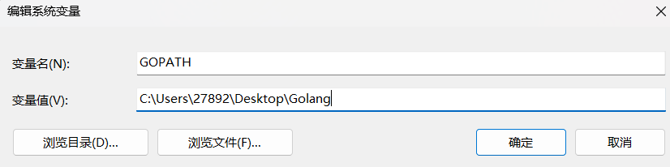

# DNS工具“q”的使用和go语言配置

> 此贴记录如何使用DNS工具“q”以及如何为服务器和PC配置go语言环境

## “q”的使用技巧--来自官方

### 官方介绍

#### 项目地址

>https://github.com/natesales/q?tab=readme-ov-file

#### 项目介绍

```tzt
一个小型命令行 DNS 客户端，支持 UDP、TCP、DoT、DoH、DoQ 和 ODoH。
本文对官方使用文档进行翻译和使用说明：带你安装到使用~	
```

### 基本使用说明

#### Examples 例子

官方演示地址：（感兴趣的可以自行去看看）
>https://asciinema.org/a/405306

```text
q example.com 							查询一个域名的默认记录
q example.com MX SOA 					或者指定一个类型列表

q example.com MX @9.9.9.9 				查询特定的服务器 
q example.com MX @https://dns.quad9.net 通过HTTPS（或TCP，TLS，QUIC，或ODoH）查询... 
q @sdns://AgcAAAAAAAAAAAAHOS45LjkuOQA 	或者从一个DNS Stamp查询

q example.com MX --format=raw 			以原始（dig）格式输出 
q example.com MX --format=json 			或者以JSON（或YAML）格式输出
```

#### Usage 用法

使用方法: `q [选项] [@服务器] [类型...] [名称]`

所有长格式（--）标志可以使用dig标准的`+[no]flag`表示法进行切换。

**应用选项:** 

```
使用方法:
  q [选项] [@服务器] [类型...] [名称]

所有长格式（--）标志可以使用dig标准的+[no]flag记法进行切换。

应用选项:
  -q, --qname=                    查询名称
  -s, --server=                   DNS服务器
  -t, --type=                     RR类型（例如A, AAAA, MX等）或类型整数
  -x, --reverse                   反向查询
  -d, --dnssec                    在OPT记录中设置DO（DNSSEC OK）位
  -n, --nsid                      设置EDNS0 NSID选项
      --subnet=                   设置EDNS0客户端子网
  -c, --chaos                     使用CHAOS查询类
  -C=                             设置查询类（默认：IN 0x01）（默认：1）
  -p, --odoh-proxy=               ODoH代理
      --timeout=                  查询超时（默认：10s）
      --pad                       设置EDNS0填充
      --http2                     使用HTTP/2进行DoH
      --http3                     使用HTTP/3进行DoH
      --id-check                  检查DNS响应ID（默认：true）
      --reuse-conn                复用对同一服务器的查询连接（默认：true）
      --txtconcat                 连接TXT响应
      --qid=                      设置查询ID（-1表示随机）（默认：-1）
  -b, --bootstrap-server=         用于引导的DNS服务器
      --bootstrap-timeout=        引导超时（默认：5s）
      --cookie=                   EDNS0 cookie
      --recaxfr                   执行递归AXFR
  -f, --format=                   输出格式（pretty, column, json, yaml, raw）（默认：pretty）
      --pretty-ttls               以可读格式格式化TTLs（默认：true）
      --short-ttls                移除pretty TTLs的零组件。（24h0m0s->24h）（默认：true）
      --color                     启用颜色输出
      --question                  显示问题部分
      --answer                    显示答案部分（默认：true）
      --authority                 显示权限部分
      --additional                显示附加部分
  -S, --stats                     显示时间统计
      --all                       显示所有部分和统计信息
  -w                              为A和AAAA记录解析ASN/ASName
  -r, --short                     仅显示记录值
  -R, --resolve-ips               为A和AAAA记录中的IP地址解析PTR记录
      --round-ttls                将TTLs四舍五入到最接近的分钟
      --aa                        在查询中设置AA（权威答案）标志
      --ad                        在查询中设置AD（认证数据）标志
      --cd                        在查询中设置CD（检查禁用）标志
      --rd                        在查询中设置RD（递归期望）标志（默认：true）
      --ra                        在查询中设置RA（递归可用）标志
      --z                         在查询中设置Z（零）标志
      --t                         在查询中设置TC（截断）标志
  -i, --tls-insecure-skip-verify  禁用TLS证书验证
      --tls-server-name=          TLS服务器名称，用于主机验证
      --tls-min-version=          使用的最小TLS版本（默认：1.0）
      --tls-max-version=          使用的最大TLS版本（默认：1.3）
      --tls-next-protos=          TLS下一个协议，用于ALPN
      --tls-cipher-suites=        TLS密码套件
      --tls-curve-preferences=    TLS曲线偏好
      --tls-client-cert=          TLS客户端证书文件
      --tls-client-key=           TLS客户端密钥文件
      --tls-key-log-file=         TLS密钥日志文件 [$SSLKEYLOGFILE]
      --http-user-agent=          HTTP用户代理
      --http-method=              HTTP方法（默认：GET）
      --pmtud                     PMTU发现（默认：true）
      --quic-alpn-tokens=         QUIC ALPN令牌（默认：doq, doq-i11）
      --quic-length-prefix        添加符合RFC 9250的长度前缀（默认：true）
      --dnscrypt-tcp              使用TCP进行DNSCrypt（默认UDP）
      --dnscrypt-udp-size=        该客户端可以发送或接收的DNS响应的最大大小（默认：0）
      --dnscrypt-key=             DNSCrypt公钥
      --dnscrypt-provider=        DNSCrypt提供者名称
      --default-rr-types=         默认记录类型（默认：A, AAAA, NS, MX, TXT, CNAME）
      --udp-buffer=               在查询中设置EDNS0 UDP大小（默认：1232）
  -v, --verbose                   显示详细日志消息
      --trace                     显示跟踪日志消息
  -V, --version                   显示版本并退出

帮助选项:
  -h, --help                      显示此帮助信息
```


**帮助选项:** 
- `-h, --help` 显示此帮助消息

### 协议支持

- UDP/TCP DNS (RFC 1034)
- DNS over TLS (RFC 7858)
- DNS over HTTPS (RFC 8484)
- DNS over QUIC (RFC 9250)
- Oblivious DNS over HTTPS (RFC 9230)
- DNSCrypt v2 (draft-dennis-dprive-dnscrypt)

### 安装

#### docker安装“q”

> 仓库地址见文章开头部分

q 可以从以下来源获取：

- 我的包仓库的 apt/yum/brew

- GitHub 发布版本

- AUR 中的 q-dns-git

- 执行git指令克隆项目

  - ```bash
    go install github.com/natesales/q@latest
    ```

- 执行docker指令

  - ```
    docker run --rm -it ghcr.io/natesales/q`
    ```

#### 二进制安装“q”

从源码安装 q：

```bash
git clone https://github.com/natesales/q && cd q

go install
```

不带调试信息的安装：

```bash
go install -ldflags="-s -w -X main.version=release"
```

> 上面两种没啥区别：只是是否显示日志文件罢了

## 使用说明--Mobai

> 我是用的服务器进行按安装和使用：请各位根据自己的使用环境俩悬着就行了

### 配置go语言环境

#### apt安装go环境

> 基于Debian的发行版本，使用apt-get安装go环境

1、安装命令

```bash
sudo apt-get install golang
```

2、设置环境变量:有三个变量GOPATH、PATH、GOROOT

·GOROOT就是go的安装路径

·GOPATH就是go的工作目录

·PATH是go安装路径下的bin目录

因为是通过apt-get方式获得，所以只需要设置GOPATH即可。

```bash
vi /etc/profile
```

打开文件后，对件修改，在文件最下面添加

```bash
export GOPATH=/goWorkPlace
```

然后按Esc，输入 `:wq`保存退出

最后，刷新文件，使更改生效

```bash
source /etc/profile
```

3、检查环境

```bash
go version  # 查看go版本

go version go1.22.4 linux/amd64
# 显示这一行表示当前我本地的golang版本是1.22.4

go env    # 查看go的环境，可以看到环境配置等信息

# 显示的内容如下
GO111MODULE=''
GOARCH='amd64'
GOBIN=''
GOCACHE='/root/.cache/go-build'
GOENV='/root/.config/go/env'
GOEXE=''
GOEXPERIMENT=''
GOFLAGS=''
GOHOSTARCH='amd64'
GOHOSTOS='linux'
GOINSECURE=''
GOMODCACHE='/root/go/pkg/mod'
GONOPROXY=''
GONOSUMDB=''
GOOS='linux'
GOPATH='/root/go'
GOPRIVATE=''
GOPROXY='https://proxy.golang.org,direct'
......
# 还有就省略咯
```

#### 从官网安装

因为发行版中的版本不是最新的，所以想要更新版本，需要从官网安装。

> golang官方包的地址
>
> https://go.dev/dl/
> 找到对应版本即可
>
> 比如我下载的是：
> https://go.dev/dl/go1.22.5.linux-amd64.tar.gz

1、下载安装包

```bash
wget https://go.dev/dl/go1.22.5.linux-amd64.tar.gz
```

2、安装

在/usr/local下安装：

```bash
sudo tar -xzf go1.22.5.linux-amd64.tar.gz -C /usr/local
```

3、配置环境变量：有三个变量GOPATH、PATH、GOROOT

·GOROOT就是go的安装路径

·GOPATH就是go的工作目录

·PATH是go安装路径下的bin目录

有两个文件可以配置环境变量，人选一个即可：

```bash
vim /etc/profile
```

打开文件后，对文件修改，在文件最下面添加

> 关于vim快速移动到最底部
>
> 先按ESC进入”普通模式“ 然后按下 `G` 即可
>
> 然后右键粘贴下面的内容即可：退出的方式见前面的apt安装

```bash
export GOPATH=/goWorkPlace

export GOROOT=/usr/local/go

export PATH=$PATH:$GOROOT/bin
```

最后，刷新文件，使更改生效。输入命令

```bash
source /etc/profile
```

检查go的安装环境见上面apt安装，这里不再赘述。

#### windows配置go语言环境

##### 下载对应的windows包

>https://go.dev/dl/

##### 修改环境变量为go配置全局环境

> Go语言环境变量配置

因为go的工具连已经设置好了goroot就不单独设置了：配置好相应的gopath即可

配置Path
Path中有其他安装程序的配置信息，这里再增加一个GO的bin目录



配置Path（（非常重要！非常重要！非常重要））
Path中有其他安装程序的配置信息，这里再增加一个GO的bin目录（如图示即可：添加相应的bin文件：具体看你解压保存到哪里了）


然后 `go env` 查看安装结果(这里只给出部分结果：其余省略：到这里就是配置好了)


### docker使用全流程

#### 官方安装go环境

```bash
# 在上面安装好go语言环境的情况下
go install github.com/natesales/q@latest
# 使用go安装依赖

docker run --rm -it ghcr.io/natesales/q
# 运行docker容器 这里 docker run --rm -it ghcr.io/natesales/q example.com 这一串就相当于”q“指令
```

如果正确显示下列内容就是说明安装已经成功了

```bash
root@debian:~/test/q# docker run --rm -it ghcr.io/natesales/q
. 24h13m23s NS a.root-servers.net.
. 24h13m23s NS b.root-servers.net.
. 24h13m23s NS c.root-servers.net.
. 24h13m23s NS d.root-servers.net.
. 24h13m23s NS e.root-servers.net.
. 24h13m23s NS f.root-servers.net.
. 24h13m23s NS g.root-servers.net.
. 24h13m23s NS h.root-servers.net.
. 24h13m23s NS i.root-servers.net.
. 24h13m23s NS j.root-servers.net.
. 24h13m23s NS k.root-servers.net.
. 24h13m23s NS l.root-servers.net.
. 24h13m23s NS m.root-servers.net.
# 正确显示了多个DNS服务器那么安装就成功了
```


> 比如
>
> ```
> docker run --rm -it ghcr.io/natesales/q example.com    
> ```
>
> 结果如下：
>
> ```bash
> root@debian:~# docker run --rm -it ghcr.io/natesales/q example.com
> example.com. 38m13s A 93.184.215.14
> example.com. 56m9s AAAA 2606:2800:21f:cb07:6820:80da:af6b:8b2c
> example.com. 10m44s NS a.iana-servers.net.
> example.com. 10m44s NS b.iana-servers.net.
> example.com. 1h47m40s MX 0 .
> example.com. 36m34s TXT "v=spf1 -all"
> example.com. 36m34s TXT "wgyf8z8cgvm2qmxpnbnldrcltvk4xqfn"
> 
> # rm就是再将每次的运行的容器删掉
> # 然后就可以将改指令作为q工具的使用
> ```

### 二进制使用全流程

#### 克隆官方项目

```bash
git clone https://github.com/natesales/q && cd q
go install
# 克隆项目和安装需要的依赖库

go install -ldflags="-s -w -X main.version=release"
# 无显示日志安装
```

使用go build将源码编译为可执行文件即可

```bash
go build -o q.exe
# 命名随意：这里保留官方的原汁原味：你也可以 test.ext 想命名什么名字都取决于你
```

显示结果如下：表示已经安装好了

```bash
PS C:\Users\27892\Desktop\q_test\q> ./q.exe
. 143h34m6s NS a.root-servers.net.
. 143h34m6s NS b.root-servers.net.
. 143h34m6s NS c.root-servers.net.
. 143h34m6s NS d.root-servers.net.
. 143h34m6s NS e.root-servers.net.
. 143h34m6s NS f.root-servers.net.
. 143h34m6s NS g.root-servers.net.
. 143h34m6s NS h.root-servers.net.
. 143h34m6s NS i.root-servers.net.
. 143h34m6s NS j.root-servers.net.
. 143h34m6s NS k.root-servers.net.
. 143h34m6s NS l.root-servers.net.
. 143h34m6s NS m.root-servers.net.
```

简单的使用如下：(详细的使用方式见上面官方文档的中文翻译)

```bash
PS C:\Users\27892\Desktop\q_test\q> ./q.exe baidu.com
baidu.com. 2h MX 10 mx.maillb.baidu.com.
baidu.com. 2h MX 15 mx.n.shifen.com.
baidu.com. 2h MX 20 jpmx.baidu.com.
baidu.com. 2h MX 20 mx1.baidu.com.
baidu.com. 2h MX 20 mx50.baidu.com.
baidu.com. 2h MX 20 usmx01.baidu.com.
baidu.com. 2h TXT "9279nznttl321bxp1j464rd9vpps246v"
baidu.com. 2h TXT "_globalsign-domain-verification=qjb28W2jJSrWj04NHpB0CvgK9tle5JkOq-EcyWBgnE"
baidu.com. 2h TXT "google-site-verification=GHb98-6msqyx_qqjGl5eRatD3QTHyVB6-xQ3gJB5UwM"
baidu.com. 2h TXT "v=spf1 include:spf1.baidu.com include:spf2.baidu.com include:spf3.baidu.com include:spf4.baidu.com -all"
baidu.com. 9m33s A 110.242.68.66
baidu.com. 9m33s A 39.156.66.10
baidu.com. 24h NS dns.baidu.com.
baidu.com. 24h NS ns2.baidu.com.
baidu.com. 24h NS ns3.baidu.com.
baidu.com. 24h NS ns4.baidu.com.
baidu.com. 24h NS ns7.baidu.com.
```